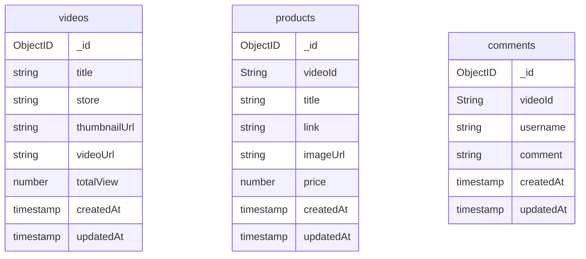

# TokoPlay

TokoPlay is a frontend of Tokopedia Play clone built in ReactJS (Vite) and Chakra UI. For the backend service can be checked on [this repo](https://github.com/limglenaldin/tokopedia-play-clone)

## Features
- List of Videos
- Detail of each video
- Live Comment using SocketIO
- Search video
- Dynamic Username


## Database Schema




## Running the Frontend

### Running directly via terminal (npm)

#### Prerequisites
- Have installed NodeJS v18 on the machine
- Have running backend service on a local machine

#### Step to Run
1. Clone the repo to your local machine
   ```
   git clone git@github.com:limglenaldin/tokopedia-play-clone-fe.git
   ```
2. Change the directory
   ```
   cd tokopedia-play-clone-fe
   ```
4. Create a `.env` file by running `cp .env.example .env`
5. Install dependencies and start the development server
   ```
   npm install
   npm run dev
   ```
6. Finally, it can be accessed on `http://localhost:3000`

### Running via Docker Compose

#### Prerequisites
- Have installed docker on the machine
- Have installed `make` on a terminal (optional)

#### Step to Run
1. Clone the repo to your local machine
   ```
   git clone git@github.com:limglenaldin/tokopedia-play-clone-fe.git
   ```
2. Change the directory
   ```
   cd tokopedia-play-clone-fe
   ```
3. Compose Docker Container and wait until done
   ```
   docker-compose -f docker-compose.yml up --build -d
   ```
   or if it has installed `make`
   ```
   make compose-up
   ```
4. Finally, it can be accessed on `http://localhost:3000`

### Running via Pull Docker Image

#### Prerequisite
- Have installed docker on the machine

#### Step to Run
1. Pull the docker image to your local machine
   ```
   docker pull limglenaldin/tokoplay
   ```
2. Create a container
   ```
   docker run -d -p 3000:3000 --name tokoplay limglenaldin/tokoplay
   ```
3. Finally, it can be accessed on `http://localhost:3000`